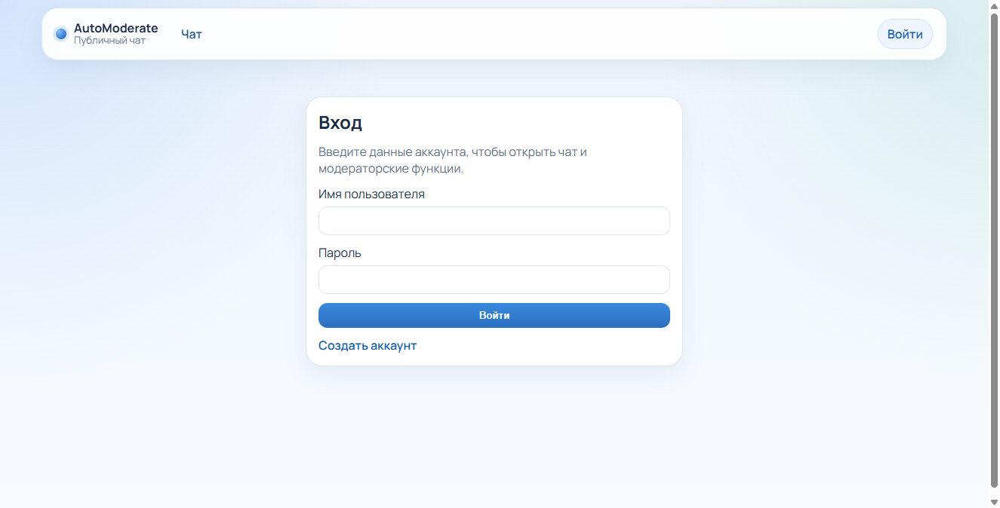
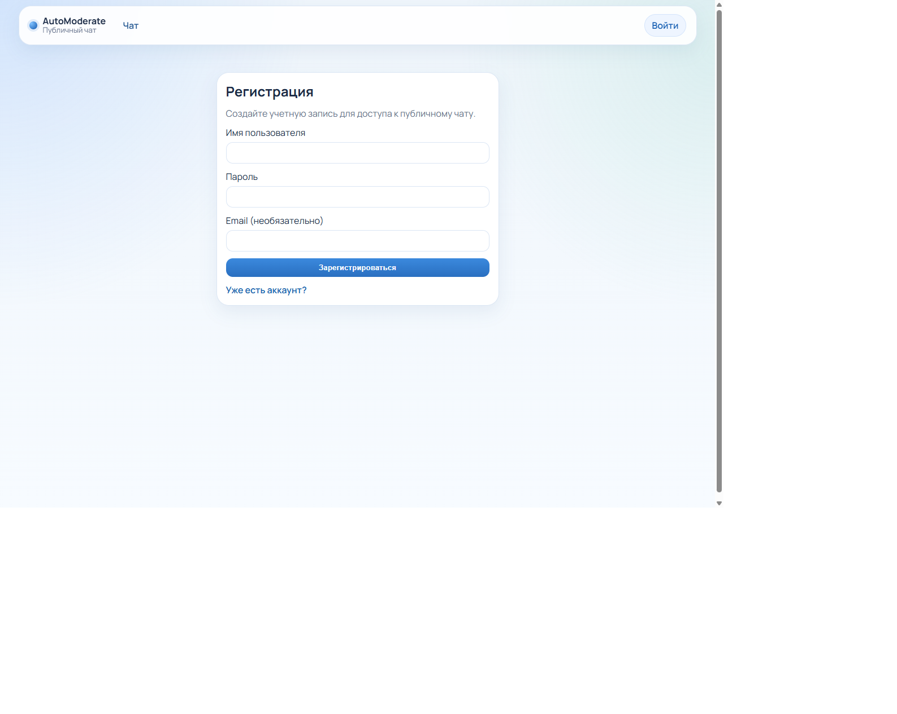
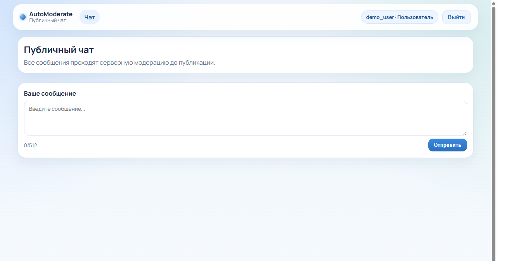
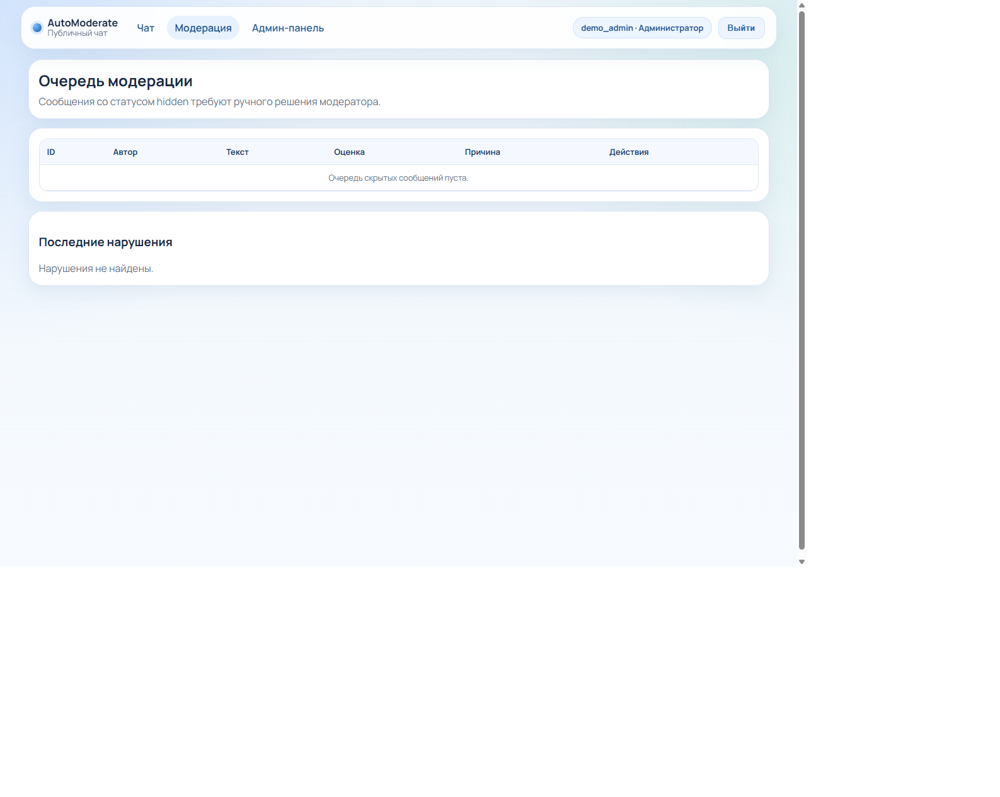
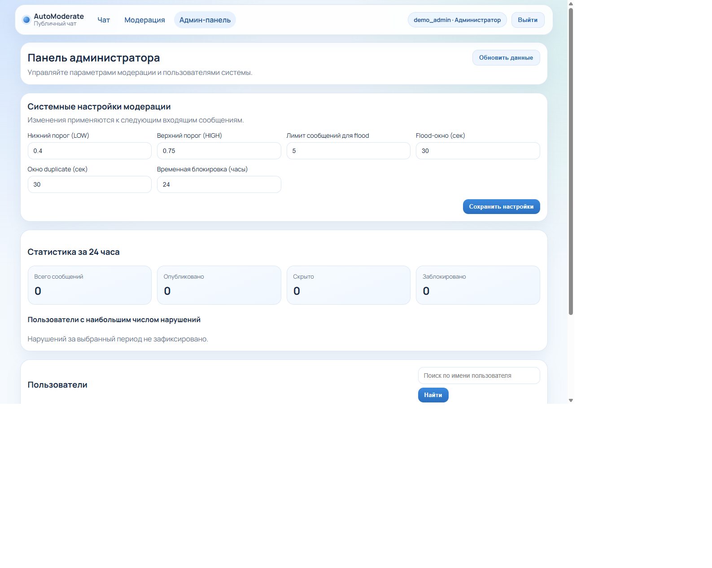

# AutoModerate — Frontend

Vue 3 интерфейс публичного чата с гибридной модерацией. Стек: **Vue 3 + TypeScript + Vite + Pinia + Vue Router + Socket.IO**.

Архитектура ближе к Feature-Sliced Design: `app` / `pages` / `widgets` / `features` / `entities` / `shared`.

## Скриншоты

### Вход



### Регистрация



### Публичный чат



Сообщения уходят на сервер и проходят модерацию до публикации.

### Очередь модерации



Доступна ролям `moderator` и `admin`. Можно одобрить, удалить сообщение или заглушить автора.

### Админ-панель



Пороги ML, flood/duplicate, статистика за 24 часа и управление пользователями.

## Экраны и роли

| Маршрут | Кто видит | Что делает |
| --- | --- | --- |
| `/login` | все | вход |
| `/register` | все | регистрация |
| `/chat` | авторизованные | публичный чат в реальном времени |
| `/moderation` | moderator, admin | очередь `hidden` и нарушения |
| `/admin` | admin | настройки, статистика, пользователи |

## Быстрый старт

Нужен запущенный backend на `http://localhost:5000` (прокси Vite).

```bash
cd frontend
npm install
npm run dev
```

Откроется `http://localhost:5173`.

Демо-аккаунты (создаёт backend):

- `demo_user` / `demo12345`
- `demo_moderator` / `demo12345`
- `demo_admin` / `demo12345`

## Скрипты

```bash
npm run dev      # локальная разработка
npm run build    # type-check + production build
npm run preview  # превью собранного билда
```

## Структура

```text
frontend/src
├── app/          # shell, router, guards
├── pages/        # экраны: login, register, chat, moderation, admin
├── widgets/      # message-feed, moderation-panel, admin-panel
├── features/     # auth, chat, moderation, admin (API + Pinia stores)
├── entities/     # типы user, message, moderation, admin
└── shared/       # http-client, env, locale, UI
```

## Как устроены запросы

- REST идёт через axios на `/api` с `withCredentials: true`
- в dev Vite проксирует `/api` и `/socket.io` на backend
- чат слушает Socket.IO события (новые сообщения, блокировки, скрытие)

Переопределить origin API можно через `VITE_API_ORIGIN`.

## Docker

Из корня монорепо:

```bash
docker compose up --build
```

Frontend будет на `http://localhost:5173` (Nginx + SPA + proxy на backend).
